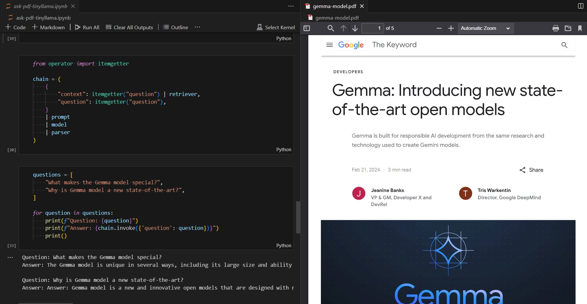

<!-- Add banner here -->
<p align="center">
    
</p>

# RAG Application: Ask Questions from a PDF Document using Large Language Models

<!-- Add buttons here -->


This project is an application of Retrieval-Augmented Generation (RAG), an AI framework that combines the power of large language models with additional information from reliable sources. Currently, I'm in the process of experimenting with various large language models to extract answers from a PDF document. The research is primarily conducted using Jupyter Notebooks, where we input a question, retrieve relevant information from the PDF document, and generate a response using the language model. Importantly, all of this can be done using open-source models, locally on our own computers, making this accessible and reproducible.

# Quickstart/Demo
To get started, clone the repo and follow the installation instructions. This project uses Ollama, an open-source tool for working with large language models locally. Download it from [Ollama](https://ollama.com). Once set up, you can ask your PDF document for information.

<p align="center">
    
</p>

# Table of Contents

- [Project Title](#project-title)
- [Quickstart/Demo](#quickstartdemo)
- [Table of Contents](#table-of-contents)
- [Installation](#installation)
- [Usage](#usage)
- [Contribute](#contribute)
- [License](#license)

# Installation
[(Back to top)](#table-of-contents)


To set up the project on your local machine, follow these steps:

1. Clone the repository: 

```shell 
git clone https://github.com/ralphcajipe/ask-pdf.git
```

2. Navigate to the project directory: 
```shell 
cd ask-pdf
```
3. Install the required dependencies: 
```shell
pip install -r requirements.txt
```

# Code Structure
[(Back to top)](#table-of-contents) 

For now, the project is structured using Jupyter Notebooks with PDF files as the data source.

# Usage
[(Back to top)](#table-of-contents)

Run the Jupyter Notebook and follow the instructions provided in the notebook. The notebook will guide you through the process of asking questions from a PDF document.`

# Contribute
[(Back to top)](#table-of-contents)

Pull requests are welcome. For major changes, please open an issue first to discuss what you would like to change.

# License
[(Back to top)](#table-of-contents)

[MIT license](./LICENSE)
